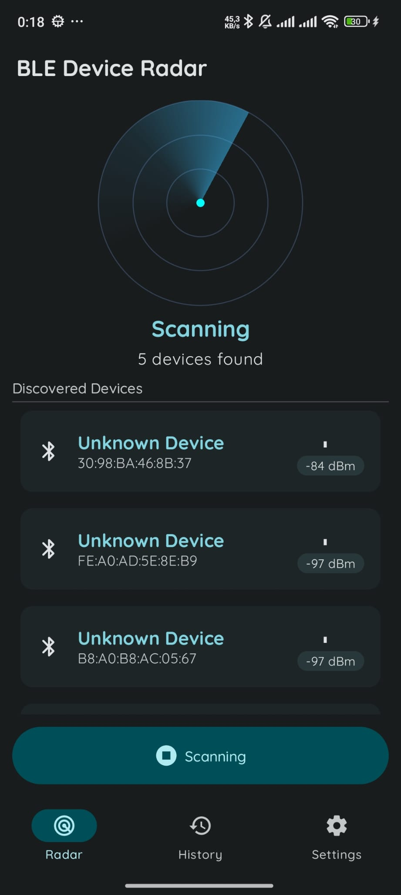
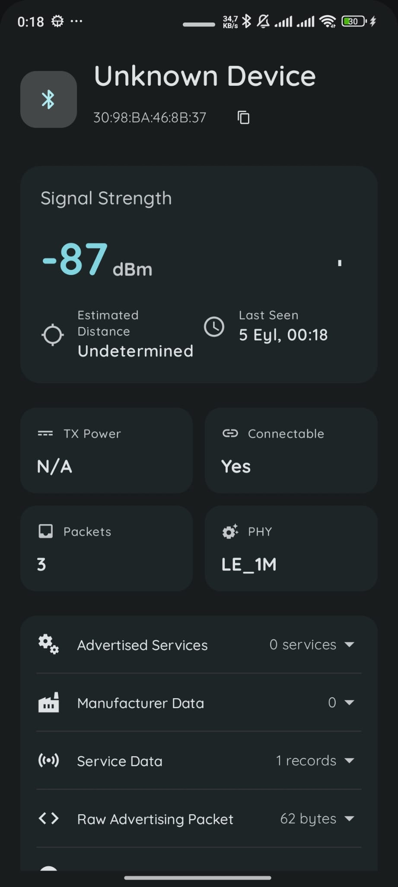
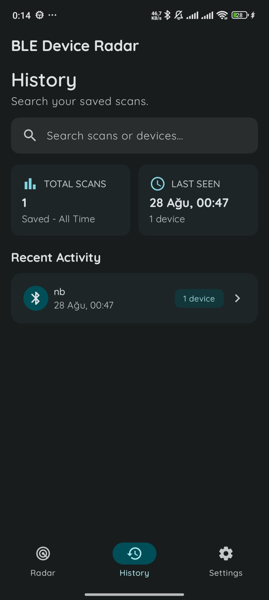
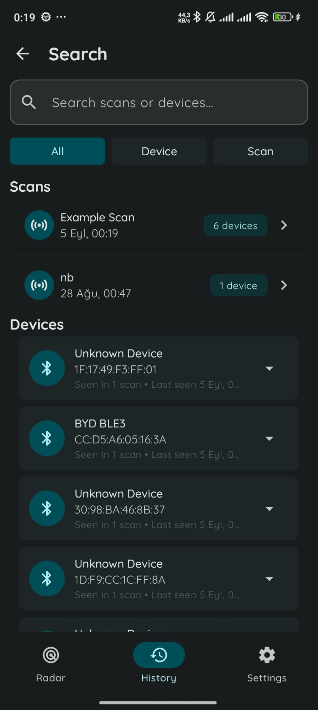
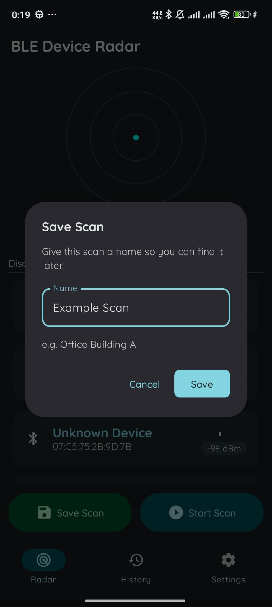
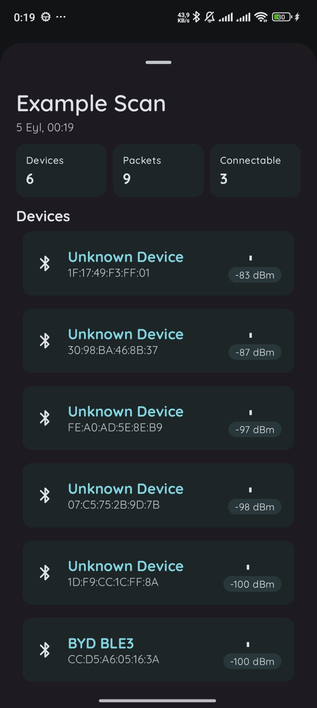
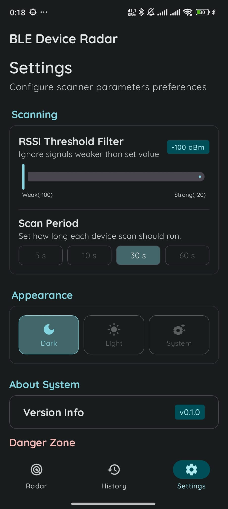

# BLE Device Radar

[](https://github.com/necdetzr/BLE-Device-Radar/actions/workflows/ci.yml)


[](LICENSE)

BLE Device Radar is a native Android application for discovering nearby Bluetooth Low Energy devices, inspecting their advertising data, and saving scan sessions for later review.

It is built with Kotlin and Jetpack Compose using a modular, layered architecture inspired by the official Now in Android project. Version `0.1.0` focuses on reliable BLE scanning, local scan history, responsive layouts, and a testable data and presentation layer.

## Features

### BLE radar

- Scan nearby Bluetooth Low Energy devices in real time.
- Display device name, MAC address, RSSI and observed packet count.
- Inspect advertised services, manufacturer data, service data and raw advertising packets.
- Handle unsupported Bluetooth hardware, disabled Bluetooth, denied permissions and scan failures.
- Configure the scan duration and RSSI threshold.
- Save completed scans with a custom name.
- Adapt the radar layout to compact and wide screens.

### Scan history

- Store scans and discovered devices locally with Room.
- View recent scans and total scan count.
- Open saved scans and inspect their devices.
- Search scans by name.
- Search devices by name or MAC address.
- See which saved scans contained a particular device.
- Delete individual scans or clear the entire scan history.
- Use compact and wide layouts in portrait and landscape configurations.

### Settings

- Choose light, dark or system theme.
- Configure scan duration.
- Configure RSSI filtering.
- View application version information.
- Permanently delete locally saved scan history.

### Privacy

BLE observations, including device addresses and advertising data, are stored locally on the device.

The scan-history database is excluded from Android cloud backup and device transfer. Users can delete all saved scan data from the Settings screen.

## Architecture

The project uses a modular, layered architecture with unidirectional data flow:

```text
Compose UI
    ↓ events
ViewModel
    ↓
Repository interfaces
    ↓
DataStore / Room / Android BLE APIs
```

ViewModels expose immutable `StateFlow` UI state. UI events are passed back to ViewModels through explicit callbacks.

Repository interfaces separate feature code from Android BLE, Room, and DataStore implementations. Dedicated use cases are introduced only when a business rule needs orchestration beyond a repository call.

## Tech stack

- Kotlin
- Jetpack Compose
- Material 3
- Compose Canvas
- Android Navigation 3
- Kotlin Coroutines and Flow
- Dagger Hilt
- Room
- Preferences DataStore
- Kotlin Serialization
- Gradle Kotlin DSL
- Version Catalogs
- Convention Plugins
- Detekt
- JUnit, MockK and Truth
- Room in-memory database tests
- Turbine
- GitHub Actions

## Module structure

```text
BLE-Device-Radar
├── app
├── build-logic
├── feature
│   ├── radar
│   ├── history
│   └── settings
└── core
    ├── ble
    ├── common
    ├── data
    ├── database
    ├── datastore
    ├── designsystem
    ├── model
    ├── navigation
    ├── testing
    └── ui
```

### Application

- `:app`  
  Application entry point, root navigation and top-level UI composition.

### Feature modules

- `:feature:radar`  
  BLE scan presentation, radar visualization, device list and scan-saving flow.

- `:feature:history`  
  Saved scan history, scan details, device history and search.

- `:feature:settings`  
  Scanner preferences, appearance settings, application information and local-data deletion.

### Core modules

- `:core:ble`  
  Android BLE scanner integration and `ScanResult` mapping.

- `:core:common`  
  Shared coroutine dispatchers and application coroutine scopes.

- `:core:data`  
  Repository contracts, implementations and data mappers.

- `:core:database`  
  Room database, entities, relations, queries and migrations.

- `:core:datastore`  
  Preferences DataStore configuration and user preference persistence.

- `:core:designsystem`  
  Theme, typography, dimensions, icons and shared navigation components.

- `:core:model`  
  Shared application models.

- `:core:navigation`  
  Navigation 3 state and navigation contracts.

- `:core:testing`
  Shared test utilities, including coroutine dispatcher rules.

- `:core:ui`  
  Reusable device cards, device feeds and detail components.

### Build logic

- `:build-logic`  
  Convention plugins used to share Android, Compose, Hilt, Room and JVM build configuration.

## Requirements

- Android Studio with JDK 17
- Android SDK 36
- Android 12 or newer (API 31+)
- A physical Android device with Bluetooth Low Energy support

A physical device is recommended because Android emulators generally cannot perform real nearby BLE scans.

## Getting started

Clone the repository:

```bash
git clone https://github.com/necdetzr/BLE-Device-Radar.git
cd BLE-Device-Radar
```

Open the project in Android Studio, sync Gradle, and run the `app` configuration on a compatible physical device.

When prompted, grant the Nearby devices permissions required for BLE scanning.

## Build, test and code quality

Build the debug application:

```bash
./gradlew assembleDebug
```

Run static analysis:

```bash
./gradlew detekt
```

Run JVM unit tests:

```bash
./gradlew testDebugUnitTest
```

Run Room instrumented tests on a connected device or emulator:

```bash
./gradlew :core:database:connectedDebugAndroidTest
```

On Windows:

```powershell
.\gradlew.bat assembleDebug
.\gradlew.bat detekt
.\gradlew.bat testDebugUnitTest
.\gradlew.bat :core:database:connectedDebugAndroidTest
```

The GitHub Actions workflow runs Detekt, JVM unit tests, and a debug build for pushes and pull requests targeting `main`.

## Screenshots

<table>
  <tr>
    <th>Radar scanning</th>
    <th>Device details</th>
    <th>Scan history</th>
    <th>History search</th>
  </tr>
  <tr>
    <td></td>
    <td></td>
    <td></td>
    <td></td>
  </tr>
  <tr>
    <th>Save scan</th>
    <th>Saved scan details</th>
    <th>Settings</th>
    <th></th>
  </tr>
  <tr>
    <td></td>
    <td></td>
    <td></td>
    <td></td>
  </tr>
</table>

## Project status

BLE Device Radar is currently preparing for its first public `0.1.0` release. Core scanning, history, settings, responsive layouts, static analysis, and automated unit tests are in place.

## License

Licensed under the [Apache License 2.0](LICENSE).
